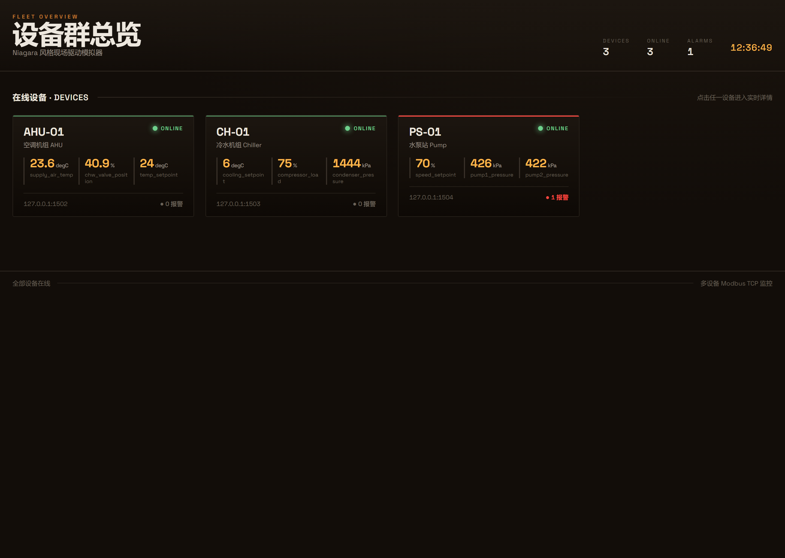
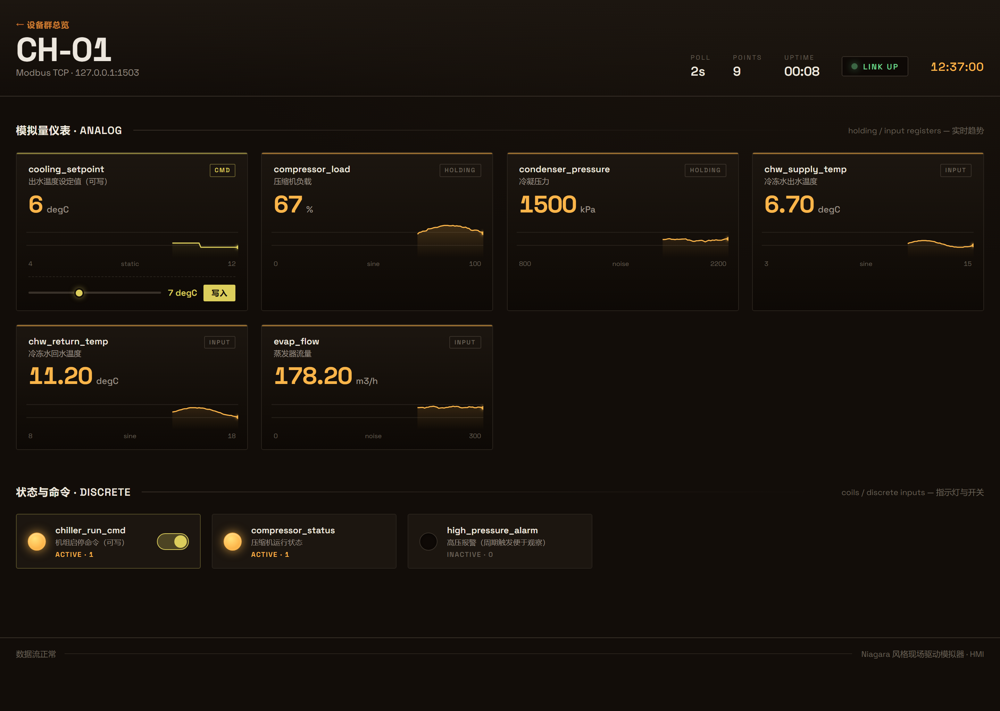
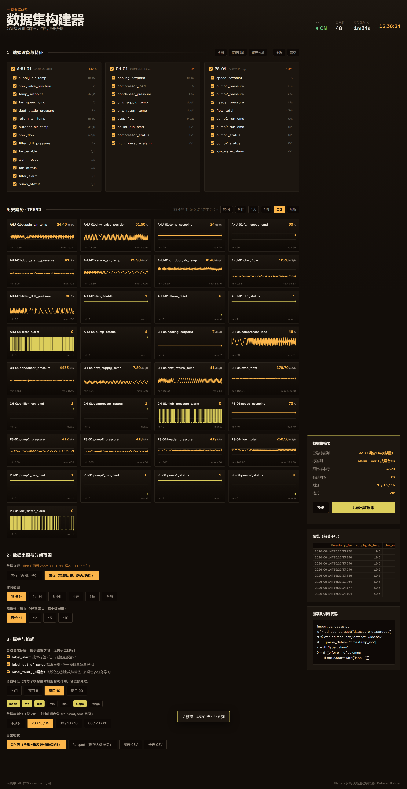
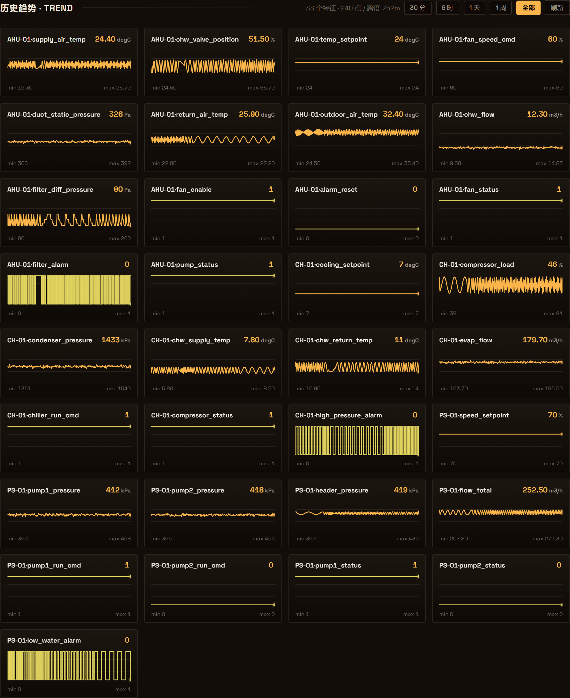

# Niagara 风格现场设备模拟器（Modbus TCP + 实时监控面板 + 自动测试）

[](https://github.com/garyguorui-tech/Webuild-IoT-Simulator/actions/workflows/ci.yml)
[](LICENSE)
[](https://www.python.org/)

为工业设备物联网场景打造的基础脚手架，模拟 Tridium / Niagara 现场驱动常用的
**Modbus TCP** 协议设备，配套**自动连接采集客户端**、**多设备实时 Web 监控面板（HMI）**
与**完整 pytest 测试套件**。点位表用 YAML 配置，增删点位/设备无需改代码；
内置可选的 **BACnet/IP** 设备扩展与 **MQTT** 转发落库。

> **最快上手（Windows）**：双击 `start.bat`，自动建环境、装依赖、起服务并打开浏览器。

### 设备群总览（多设备）


### 单设备实时详情（点击总览中的设备进入）


> 总览页统一展示所有设备的在线状态、报警数与关键指标；点击任一设备进入实时详情：
> 模拟量渲染为带实时趋势曲线的仪表，开关量渲染为指示灯/工业开关，可写点可直接下发命令。

### 数据集构建器 —— 给算法研究员选数据/打标/导出训练集（物理 AI 建模）


**历史趋势图**：每个变量一张时间序列小图，直观看出区间内各数据的变化趋势（正弦/噪声/阶跃/报警方波一目了然）。
可切**数据来源**：内存（近期，快）/ **磁盘（完整历史，跨天/跨周）**——下图为磁盘源回看 7 小时历史。


> 平台后台持续记录所有设备所有点位的**时间对齐多变量样本**。研究员可在此界面：
> 勾选**设备/特征点位** → 选**时间范围+降采样** → 开启**滑窗特征**（每个模拟量可选 mean/std/min/max/diff/slope/range）
> → 勾选**自动合成标签**（全局 `label_alarm`/`label_out_of_range`、**按设备** `label_fault__<设备>`，无需手工打标）
> → 选**数据集划分**（按时间顺序自动切 train/val/test）→ 选**格式**（ZIP / **Parquet** / CSV）→ 预览 → 一键下载。
> 导出含元数据与 pandas 加载示例，可直接用于节能、控制策略、故障诊断、多设备多任务学习。

---

## 1. 它能做什么

| 模块 | 说明 |
|------|------|
| **模拟设备服务端** | 真正监听 TCP 端口、可被任意 Modbus 主站（本客户端 / Niagara / modpoll 等）连接。点位映射到 holding / input registers 与 coils / discrete inputs，值随时间正弦波动、随机游走、阶跃变化。 |
| **多设备总览 + 实时 HMI** | 内置空调机组/冷水机组/水泵站三台设备。Flask 后端桥接多台 Modbus，浏览器经 SSE 实时刷新；总览页统一展示在线/报警/KPI，点击下钻单设备详情（趋势曲线/指示灯/写命令）。 |
| **数据集构建器（ML 训练数据）** | 后台持续记录时间对齐多变量样本；研究员界面按设备/特征筛选并**逐变量查看历史趋势图**，**数据来源可切内存/磁盘（完整历史跨天跨周回看）**，可选时间范围/降采样、**滑窗特征**(7种统计量)、自动合成标签(全局+按设备故障)、**自动切分 train/val/test**，导出 ZIP / **Parquet** / CSV（含元数据 + pandas 示例），供物理 AI 建模（节能/控制/故障诊断/多任务）。 |
| **自动连接客户端** | 启动即连接、周期轮询全部点位并打印（可选落 CSV / 转发 MQTT），**断线自动指数退避重连**。 |
| **自动测试** | pytest 覆盖连接性、数据正确性、读写回环、断线重连、轮询压力、Web 接口、设备群配置、数据集构建/标签/滑窗/划分/Parquet，**57 个用例全绿**。 |
| **可扩展** | 仿真引擎与协议解耦；`simulator/bacnet_server.py` 提供 BACnet/IP（可选 bacpypes3），`client/mqtt_sink.py` 提供 MQTT/InfluxDB 落库。 |

模拟的设备是一台空调机组 **AHU-01**，点位包含送风/回风/室外温度、冷冻水阀开度与流量、
风管静压、过滤器压差、风机/水泵启停与状态、温度设定值等——覆盖温度、压力、流量、
开关状态、设定值等常见类型，混合四种 Modbus 寄存器区。

---

## 2. 目录结构

```
niagara-field-sim/
├── start.bat / start.sh     # 一键启动：建环境→装依赖→起设备群→开浏览器
├── config/
│   ├── points.yaml          # AHU-01 点表（地址/类型/单位/初值/量程/变化模式）
│   ├── chiller.yaml         # CH-01 冷水机组点表
│   ├── pump.yaml            # PS-01 水泵站点表
│   └── fleet.yaml           # 设备群清单（设备→点表→端口）—— 增删设备改这里
├── simulator/               # 模拟设备服务端
│   ├── points.py            # 点位/设备群模型 + YAML 加载校验（三端共用）
│   ├── engine.py            # 仿真引擎：sine / noise / step / static 四种变化模式
│   ├── modbus_server.py     # Modbus TCP 服务端（pymodbus）
│   ├── bacnet_server.py     # BACnet/IP 扩展（可选 bacpypes3）
│   └── run_simulator.py     # 单台模拟器启动入口
├── client/                  # 采集客户端
│   ├── modbus_client.py     # 带断线重连的 Modbus 采集客户端
│   ├── recorder.py          # 历史数据记录器：对齐快照 → 训练数据集导出
│   ├── mqtt_sink.py         # MQTT 转发（可选 paho-mqtt）
│   ├── influx_sink.py       # InfluxDB v2 落库（可选 influxdb-client）
│   ├── run_collector.py     # 设备群采集器：Modbus → InfluxDB + MQTT（Docker 用）
│   ├── run_recorder.py      # 无界面历史数据记录器（长期落盘 CSV）
│   └── run_client.py        # 客户端启动入口（打印 / 落 CSV / 转 MQTT）
├── web/                     # 实时监控面板（HMI）
│   ├── app.py               # Flask 后端：多设备 DataHub→内存→REST/SSE + 数据集导出
│   └── static/              # overview.* 总览 / device.* 详情 / dataset.* 数据集构建器 / app.js / style.css
├── tests/                   # pytest 测试套件（57 用例）
│   ├── conftest.py          # 夹具：后台线程内启动真实模拟器供测试连接
│   ├── test_config.py       # 配置加载 / 点位编解码 / 设备群加载
│   ├── test_connectivity.py # 连接性
│   ├── test_data_read.py    # 数据读取正确性 / 动态变化
│   ├── test_read_write.py   # 读写回环
│   ├── test_reconnect.py    # 断线重连
│   ├── test_polling_stress.py # 多点位轮询压力
│   └── test_web_api.py      # Web 接口（fleet/meta/history/write/dataset）
├── docker/                  # Docker 整链路
│   ├── Dockerfile           # 模拟器/采集器镜像
│   ├── requirements-extra.txt
│   └── grafana/             # 数据源 + 看板 provisioning
├── docker-compose.yml       # 一键拉起 模拟器+EMQX+InfluxDB+Grafana
├── data/recordings/         # 记录器持续落盘的历史 CSV（数据集「磁盘源」从这里读，跨天/跨周回看）
├── .env.example             # 整链路 Token/组织/桶 默认值
├── tools/                   # 开发辅助（截图 / console 检查 / 数据集验证）
├── run_fleet.py             # 一键演示：起设备群全部模拟器 + 总览面板
├── run_demo.py              # 一键演示：单设备模拟器 + 面板
├── requirements.txt
├── pytest.ini
└── README.md
```

---

## 3. 安装

需要 **Python 3.10+**（开发环境为 3.12）。建议用虚拟环境：

```bash
cd niagara-field-sim
python -m venv .venv
# Windows (PowerShell):  .venv\Scripts\Activate.ps1
# Git Bash / Linux / mac:
source .venv/Scripts/activate        # Linux/mac: source .venv/bin/activate
pip install -r requirements.txt
```

> **为什么固定 `pymodbus==3.9.2`？** pymodbus 3.10+ 重构了 datastore API
> （`ModbusSlaveContext` → `ModbusDeviceContext`，引入 `SimData`），服务端实现针对 3.9
> 的经典 API 编写。升级需同步调整 `simulator/modbus_server.py`。

---

## 4. 使用

### 4.0 一键启动（最快上手）

- **Windows**：双击 `start.bat`
- **Git Bash / Linux / macOS**：`bash start.sh`

脚本会自动创建虚拟环境、安装依赖、启动**设备群**（3 台模拟器 + 总览面板）并打开浏览器。
首次较慢（装依赖），之后秒开。

或手动：

```bash
python run_fleet.py --open          # 设备群总览，浏览器自动打开 http://127.0.0.1:8000
python run_demo.py  --open          # 只演示单台 AHU-01
```

### 4.1 启动模拟器（单台）

```bash
python -m simulator.run_simulator                       # 默认 127.0.0.1:1502
python -m simulator.run_simulator --port 1502 --update-interval 0.5
python -m simulator.run_simulator --bacnet              # 同时起 BACnet/IP（需 bacpypes3）
```

### 4.2 启动监控面板（生产推荐：模拟器与面板分进程）

```bash
# 设备群：先按 fleet.yaml 各起一台模拟器，再起面板
python -m web.app --web-port 8000          # 读 config/fleet.yaml（缺省回退单设备 --config）
# 浏览器访问 http://127.0.0.1:8000
```

面板能力：设备群总览（在线/报警/KPI）→ 点击下钻单设备实时详情；趋势曲线、越限红色告警、
指示灯/开关、对可写点在页面直接下发写命令。

### 4.3 增删设备

编辑 `config/fleet.yaml` 加一条 `devices` 项，指向一份点表 yaml、给个不冲突的端口即可：

```yaml
devices:
  - name: AHU-02
    config: config/my_ahu2.yaml
    port: 1505
    type: 空调机组 AHU
```

### 4.5 启动采集客户端（命令行/落库）

```bash
python -m client.run_client                             # 打印
python -m client.run_client --cycles 4 --csv readings.csv
python -m client.run_client --mqtt 127.0.0.1:1883       # 转发到 MQTT broker（需 paho-mqtt）
```

### 4.6 增删点位

直接编辑对应设备的点表 yaml（如 `config/points.yaml`），新增一条 `points:` 项即可。
模拟器、客户端、面板都从同一份配置读取，重启后生效。字段含义见该文件顶部注释。

```yaml
- name: my_new_sensor
  description: 我的新传感器
  register_type: holding      # holding | input | coil | discrete
  address: 10
  unit: "kPa"
  scale: 10                   # raw = round(eng * scale)
  initial: 100.0
  min: 0.0
  max: 200.0
  writable: false
  simulation: { mode: sine, amplitude: 5.0, period: 60, noise: 0.2 }
```

### 4.7 数据集构建器（选数据 / 打标 / 导出训练集）

平台启动后即在后台持续记录所有设备所有点位的时间对齐样本。

- **网页（推荐，给研究员用）**：总览页右上「⬇ 数据采集」进入 `/dataset`：
  1. 勾选设备 / 特征点位（支持按模拟量/开关量过滤、全选/清空）；**「历史趋势」区**为每个所选变量
     画出时间序列小图，直观看变化趋势
  2. 选**数据来源**（内存近期 / **磁盘完整历史**，磁盘可跨天/跨周回看，按钮旁显示可回看时长）、
     时间范围（15 分钟 ~ 1 天 / 1 周 / 全部）与降采样（×1/×2/×5/×10）
  3. 开启滑窗特征（窗口 5/10/20）：勾选统计量 mean/std/min/max/diff/slope/range，每个模拟量附对应 `__<stat>` 列
  4. 勾选自动合成标签：`label_alarm`（全局故障）、`label_out_of_range`（越限）、
     `label_fault__<设备>`（按设备故障，多任务学习用）
  5. 选数据集划分（不划分 / 70·15·15 / 80·10·10 / 60·20·20）：ZIP 内按时间顺序分 `train/ val/ test/` 目录
  6. 选格式（ZIP / Parquet / 宽表 CSV / 长表 CSV）→ 预览 → 一键下载
- **接口**：`POST /api/dataset/build`（body 含 `source: memory|disk`、`{minutes,devices[],columns[],downsample,window,window_stats[],split,labels{...},format}`）、
  `POST /api/dataset/preview`、`POST /api/dataset/series`（历史趋势）、`GET /api/dataset/disk`（磁盘历史概要）、`GET /api/dataset/schema`、`GET /api/dataset/export`（快速）。
- **长期落盘 CLI**（无界面，连续采集到 `data/recordings/*.csv`）：

```bash
python -m client.run_recorder --interval 2            # 一直采，Ctrl-C 停
python -m client.run_recorder --interval 5 --minutes 60   # 采 60 分钟后自动停
```

导出的 ZIP 含：`dataset_wide.csv`/`.parquet`（宽表特征矩阵，每行一个对齐样本、每列一个 `设备.点位`，
末尾可含 `label_*` 标签列）、`dataset_long.csv`（长表）、`metadata.json`（列定义/单位/量程/采样/标签定义）、
`README.txt`（pandas 加载示例）。样例见 `docs/sample_dataset.zip`。

```python
import pandas as pd
df = pd.read_parquet("dataset_wide.parquet")        # 或 read_csv(... parse_dates=["timestamp_iso"])
y = df["label_alarm"]                                # 全局故障标签（自动合成）
y_multi = df[[c for c in df if c.startswith("label_fault__")]]   # 多设备多任务标签
X = df[[c for c in df.columns if not c.startswith("label_")]]    # 含 __mean/__std/__diff 滑窗特征
# 节能/控制：*_setpoint / *_cmd 为动作量；metadata.json 的 min/max 可做物理约束/归一化
```

> Parquet 导出需 `pip install pyarrow`（Docker 镜像已含）；未装时仅 CSV/ZIP 可用，界面会提示。

### 4.8 运行测试

```bash
pytest                              # 全部 57 用例
pytest tests/test_web_api.py -v     # 只跑 Web 接口（含数据集构建/标签/Parquet）
```

---

## 5. Docker 一键整链路（含 EMQX + InfluxDB + Grafana）

> 需要本机安装 **Docker Desktop**。这是生产风格的完整时序监控栈，与上面的纯 Python
> 演示相互独立。

```
fieldsim ──Modbus──> collector ──┬──> InfluxDB ──> Grafana(可视化)
(3台模拟器+面板)                  └──> EMQX (MQTT broker)
```

```bash
cd niagara-field-sim
cp .env.example .env          # 可选：改 Token/组织/桶
docker compose up -d --build  # 拉起 5 个服务
docker compose ps             # 看状态
docker compose logs -f collector   # 看采集器把数据写进 Influx/MQTT
```

启动后访问：

| 服务 | 地址 | 账号 |
|------|------|------|
| 设备群监控面板（自带 HMI） | http://localhost:8000 | — |
| **Grafana 时序看板** | http://localhost:3000 | admin / admin（已开匿名只读） |
| EMQX Dashboard（看 MQTT 消息） | http://localhost:18083 | admin / public |
| InfluxDB UI | http://localhost:8086 | admin / admin12345 |

Grafana 已自动配置 InfluxDB 数据源与「现场设备时序看板」（含设备下拉、模拟量趋势、
最新值、开关量状态时间线），打开即有数据。停止与清理：

```bash
docker compose down           # 停止
docker compose down -v        # 停止并删除 InfluxDB 数据卷
```

各服务组成：`docker-compose.yml`（编排）、`docker/Dockerfile`（模拟器/采集器镜像）、
`client/run_collector.py`（Modbus→Influx+MQTT 采集器）、`client/influx_sink.py`、
`docker/grafana/`（数据源与看板 provisioning）。

---

## 6. 监控面板技术说明

```
                       ┌─ DataHub(AHU-01) ──Modbus──> 模拟器:1502
浏览器 ─HTTP/SSE─> Flask ┼─ DataHub(CH-01)  ──Modbus──> 模拟器:1503
        (web/app.py)    └─ DataHub(PS-01)  ──Modbus──> 模拟器:1504
```

- 每台设备一个 `DataHub`（Modbus 主站），后台线程持续轮询，最新值与历史缓冲（每点 120 样本）
  保存在内存、断线自动重连；`FleetHub` 聚合多台。
- 接口：`GET /api/fleet`（设备群概要）、`GET /api/fleet/stream`（**SSE** 总览）、
  `GET /api/meta|history|stream?device=`（单设备）、`POST /api/write`（写可写点）。
- 前端零构建依赖：原生 HTML/CSS/JS，趋势曲线用 `<canvas>` 逐帧绘制；
  控制室仪表盘风格（暖琥珀仪表 + 暖深炭底），数字用 tabular figures 防跳动。

---

## 7. 验证证据（实际运行输出）

以下均在开发环境（Windows 11 + Python 3.12 + pymodbus 3.9.2）真实跑出。

### 7.1 模拟器 + 客户端：能读到动态数据

```
INFO  simulator.modbus: Modbus TCP simulator 'AHU-01' listening on 127.0.0.1:15020 (14 points)
INFO  client.modbus: connected to 127.0.0.1:15020

─── cycle 1 ──────────────────────────────
  supply_air_temp           23.90 degC      ┐ 正弦
  chw_valve_position        49.50 %         │ 正弦
  duct_static_pressure     330.00 Pa        ┘ 随机游走
  temp_setpoint             24.00 degC   ← static，保持初值
─── cycle 2 ──────────────────────────────
  supply_air_temp           24.30 degC      ↑ 变化
  chw_valve_position        50.50 %         ↑
  duct_static_pressure     353.00 Pa        ↑
─── cycle 4 ──────────────────────────────
  supply_air_temp           25.00 degC      ↑
  chw_valve_position        55.50 %         ↑
  duct_static_pressure     360.00 Pa        ↑
```

### 7.2 写入回环（写 holding register 与 coil 再读回）

```
temp_setpoint 24.0 → 写 27.5 → 读回 27.5 (raw=275 = 27.5×scale10) ✓
fan_enable    1    → 写 0    → 读回 0 ✓
```

### 7.3 多设备 Web 监控面板

实时截图见本文档顶部（`docs/fleet-overview.png` 总览、`docs/device-chiller.png` 详情）。
三台设备同时在线，`/api/fleet` 实测输出：

```
[AHU-01 ] 空调机组 AHU     online=True alarms=1 | supply_air_temp=21.8degC, chw_valve_position=65.4%, ...
[CH-01  ] 冷水机组 Chiller  online=True alarms=1 | cooling_setpoint=7.0degC, compressor_load=90.0%, ...
[PS-01  ] 水泵站 Pump       online=True alarms=0 | speed_setpoint=70.0%, pump1_pressure=395.0kPa, ...
跨设备写 CH-01.cooling_setpoint=6.0 -> True
```

前后端实测无 console error，SSE 实时推送，总览/详情两页均正常，写命令按设备路由成功。

### 7.4 BACnet/IP 扩展（实测 bacpypes3 0.0.106）

```
BACnet device: device,599 | objects: 14
  supply_air_temp      analog-value,0  presentValue=22.5
  fan_enable           binary-value,0  presentValue=active
  filter_alarm         binary-value,3  presentValue=inactive
after 1.5s supply_air_temp presentValue = 22.9     ← 复用同一仿真引擎，值在变化
```

寄存器点映射为 Analog Value、开关点映射为 Binary Value，与 Modbus 共用同一份点表与引擎。

### 7.5 数据集构建器（端到端实测）

起设备群 → 记录 → 按选择构建，实测：

```
schema:            devices ['AHU-01','CH-01','PS-01']  label_options ['alarm','out_of_range']
preview CH-01:     特征列=9  标签列=['label_alarm','label_out_of_range']
downsample x2:     rows 减半（全列 33）
按设备故障标签:     ['label_fault__AHU-01','label_fault__CH-01','label_fault__PS-01']
滑窗特征(窗口5):    AHU-01.supply_air_temp + __mean/__std/__diff   （metadata derived: mean/std/diff）
parquet:           带 label/滑窗列正常写出；zip(main=parquet) 含 .parquet+.csv+long+metadata+README
```

滑窗统计量可选（mean/std/min/max/diff/slope/range）、按时间顺序自动切分 train/val/test 实测：

```
window_stats=['min','max','slope'] → 列 *.__min/__max/__slope（未选的不出现）
split '70/15/15' → zip 含 train/ val/ test/ 各 dataset_wide.csv(.parquet)；行数 9/2/3，三段之和=全量(不丢样本)
```

按设备/特征筛选、降采样、滑窗特征（7 选）、全局+按设备标签、train/val/test 划分、Parquet 导出均通过；
样例数据集见 `docs/sample_dataset.zip`。**历史趋势**接口 `/api/dataset/series` 实测返回多列时间序列，
界面逐变量画出趋势小图（见 `docs/dataset-trends.png`）。

**数据来源 内存/磁盘 切换**实测（`/api/dataset/disk` + series）：

```
磁盘历史: available=True files=11 rows=101404 span=7h1m  (08:33 ~ 15:35)
趋势 全部:  内存=14 点 / 26s     磁盘=300 点(抽样) / 7h1m   ← 磁盘解锁完整跨小时/跨天历史
```

内存缓冲受 30000 行上限；磁盘源读 `data/recordings/*.csv` 全量，支持真正跨天/跨周回看，导出亦可用 `source=disk`。

### 7.6 pytest：全部通过

```
tests/test_config.py .........           [ 21%]
tests/test_connectivity.py ...           [ 28%]
tests/test_data_read.py ......           [ 42%]
tests/test_polling_stress.py ....        [ 52%]
tests/test_read_write.py ......          [ 47%]
tests/test_reconnect.py ...              [ 52%]
tests/test_web_api.py ...........................  [100%]

============================= 57 passed in 32.91s =============================
```

> `test_reconnect.py` 会真实停掉再重启模拟器；强制关闭 TCP 服务时
> pymodbus 内部可能打印一行 `Task was destroyed but it is pending` 的 asyncio
> 清理提示，属正常现象，不影响结果。

### 7.7 Docker 整链路（已校验编排，未在本环境实跑容器）

`docker-compose.yml` 经 YAML 解析通过（5 服务 fieldsim/collector/emqx/influxdb/grafana，
Token 三处用同一变量），Grafana 看板 JSON 解析通过（3 面板）。采集器 `run_collector.py`
已对运行中的设备群实跑验证（连上 AHU-01/CH-01/PS-01 三台并轮询）：

```
collector: 采集器启动：3 台设备 @ 127.0.0.1, 周期 1.0s
collector: [AHU-01] connected
collector: [CH-01] connected
collector: [PS-01] connected
```

容器编排本身需在装有 Docker Desktop 的机器上 `docker compose up -d --build` 实跑。

---

## 8. 架构要点

```
        config/*.yaml + fleet.yaml  (单一数据源：点表 + 设备群清单)
                           │
        ┌──────────────────┼──────────────────────┐
        ▼                  ▼                       ▼
  simulator (服务端)   client (主站/落库)      web (监控面板)
  SimulationEngine     FieldDeviceClient        Flask + SSE
  sine/noise/step  →   read/write/poll      →   总览/详情/写命令
  写值回调 → datastore  断线重连(退避)           FleetHub→DataHub 内存中心
  (hr/ir/co/di)        CSV / MQTT / Influx       REST + EventSource
        │                                          │
        └────────────── Modbus TCP ────────────────┘
```

- **协议无关的仿真引擎**：`engine.py` 只算工程值、通过回调写入数据区，不关心底层是
  Modbus 还是 BACnet。新增协议复用同一引擎与同一份点表。
- **点位是唯一真相**：`points.py` 被服务端/客户端/面板共同导入，地址、缩放、量程只写一遍。
- **可写点用 `static` 模式**：引擎从不覆盖 static 点，客户端/面板写入的值才能稳定保持。
- **测试连真实 TCP**：`conftest.py` 在后台线程独立事件循环里跑真模拟器，测试经真实 socket 连接。

---

## 9. 扩展方向

- **数据集构建器**：选设备/特征、降采样、滑窗特征(7统计量)、全局+按设备标签、train/val/test 划分、ZIP/Parquet/CSV（见第 4.7 节，已实现）。
- **Docker 整链路**：`docker compose up` 一键拉起 模拟器 + EMQX + InfluxDB + Grafana（见第 5 节，已实现）。
- **BACnet/IP**：`pip install bacpypes3` 后 `--bacnet` 启动（已实测可用）。
- **MQTT / InfluxDB 落库**：`client/mqtt_sink.py` 的 `MqttSink`、`client/influx_sink.py` 的 `InfluxSink`
  均已实现，`run_collector.py` 把二者串成采集器；也可作为 `poll_forever(on_readings=...)` 回调。
- **更多协议**：实现新的 `*_server.py`，提供 `write_func(point, raw)` 回调即可接入引擎。
- **更多标签/特征工程**：在 `recorder.py` 的 `_build` 里加按设备故障标签、滑窗特征、异常分数等。

---

## 10. 许可证

本项目采用 [MIT License](LICENSE) 开源，可自由用于商业/非商业用途。
